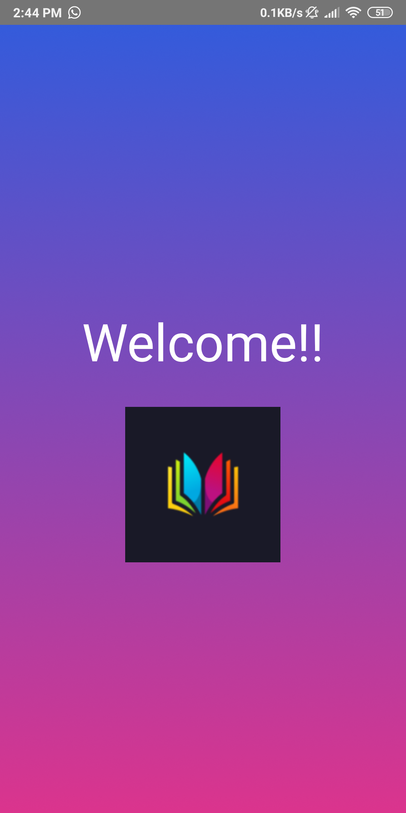
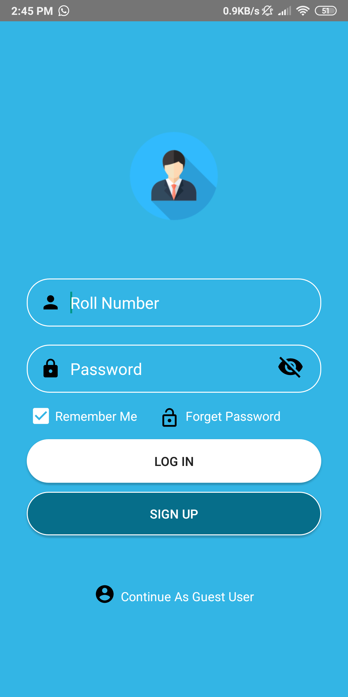
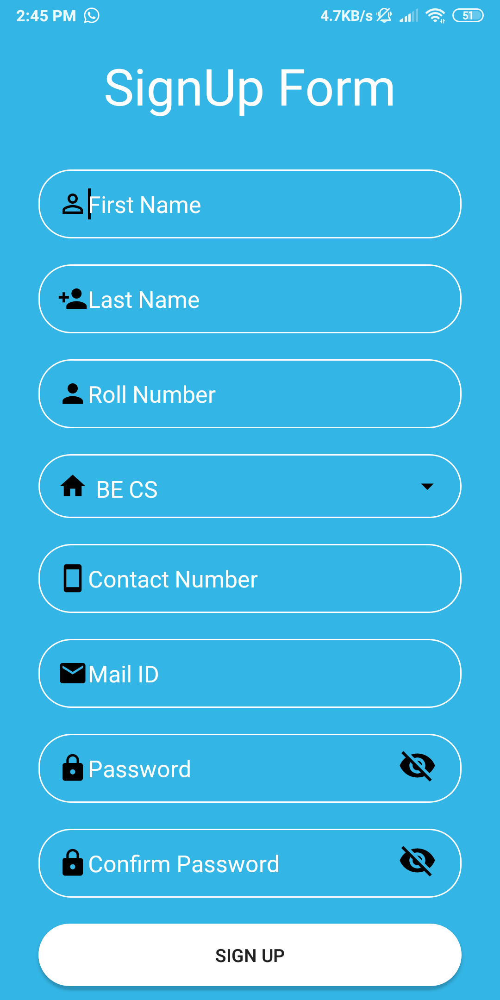
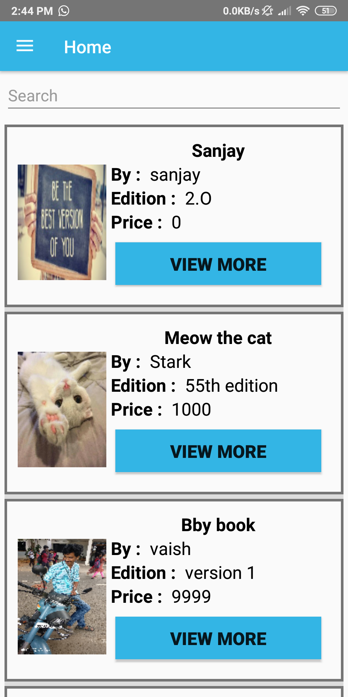
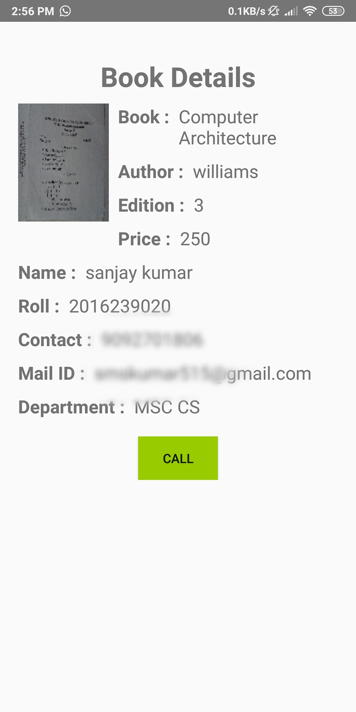
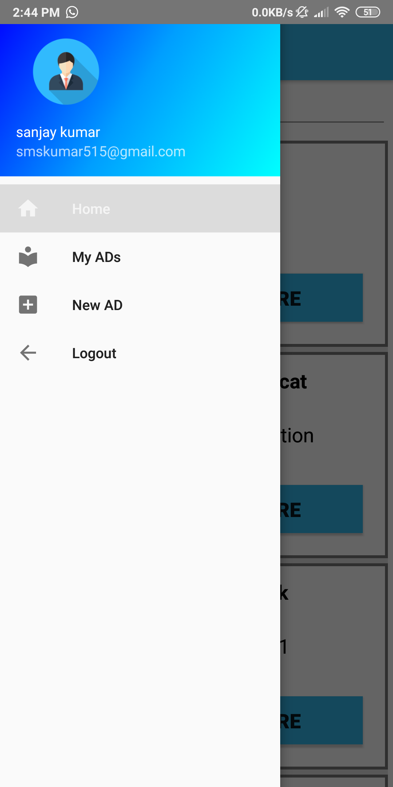
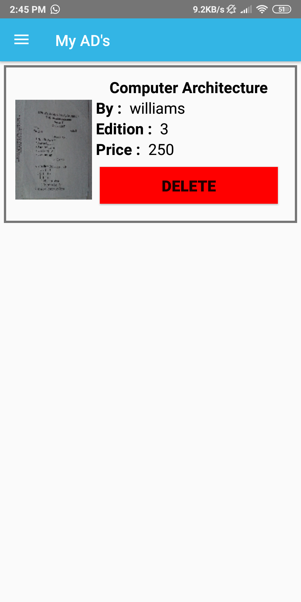
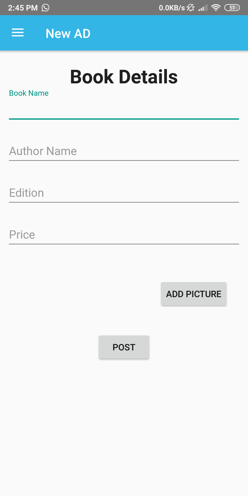

# BookOlx
 This is an Android app for Book Exchange within an university or campus. App allows user to post a new ad (or) delete a posted ad (or) to fetch details of any posted ad. 

# Screenshots

# How to use
1. Clone or download this repo.
2. Get the apk inside BookOlx->app->app-debug.apk
3. Install this in mobile and signup for a new account.

# Create a similar setup
1. Clone or download this repo.
2. Create a new MongoDB instance and change the mongodb url inside the backend code.
3. Host the backend NodeJS server and use that link in the app.
4. Then build the app and generate a new apk for your own use.

# Contributions
Contributions are welcome. Please read the [contributions guide](CONTRIBUTING.md) for more information.

# License
Copyright 2018 BookOlx.
